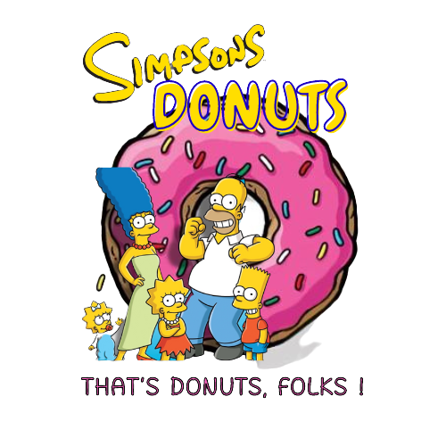

<h1 align="center">
     
</h1>

<h1 align="center">

</h1>

## 🖇️Para acessar a demonstração do projeto

[Clique aqui](https://vercel.com/emanuelletakenawa/javascript-dom-simpsons-donuts)

## 📜Sobre

Praticando a utilização do DOM, criei e estilizei essa lista de uma lojinha de donuts

## 👩🏻‍💻Tecnologias utilizadas
- HTML5
- CSS
- JAVASCRIPT (DOM)

## 🧡Autora
- [@emanuelletakenawa](https://github.com/emanuelletakenawa)
